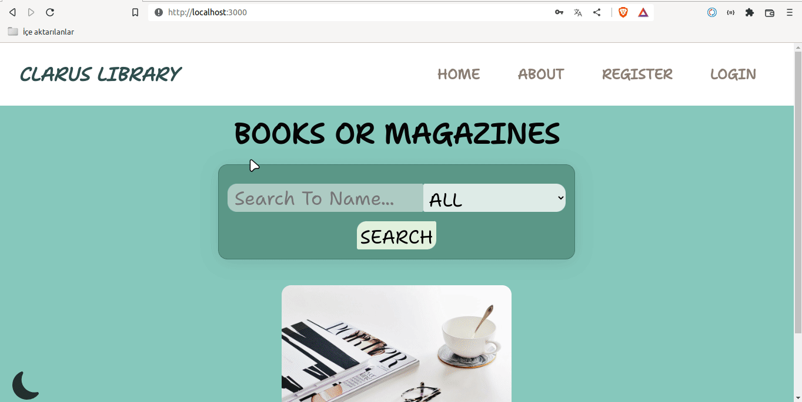

```
|
|----readme.md     
SOLUTION
├── public
│     └── index.html
├── src
│    ├── App.js
│    ├── assets
│    │   ├── about.png
│    │   ├── book.jpg
│    │   ├── books.jpg
│    │   └── const.png
│    ├── components
│    │   ├── card
│    │   │   ├── Card.jsx
│    │   │   └── Card.style.jsx
│    │   ├── footer
│    │   │   ├── Footer.jsx
│    │   │   └── Footer.style.jsx
│    │   ├── header
│    │   │   ├── Header.jsx
│    │   │   └── Header.style.jsx
│    │   ├── icon
│    │   │   ├── Icon.jsx
│    │   │   └── Icon.style.jsx
│    │   └── navbar
│    │       ├── Navbar.jsx
│    │       └── Navbar.style.jsx
│    ├── helper
│    │   └── iconData.js
│    ├── index.css
│    ├── index.js
│    ├── pages
│    │   ├── about
│    │   │   ├── About.jsx
│    │   │   └── About.style.jsx
│    │   ├── detail
│    │   │   ├── Detail.jsx
│    │   │   └── Detail.style.jsx
│    │   ├── home
│    │   │   ├── Home.jsx
│    │   │   └── Home.style.jsx
│    │   ├── login
│    │   │   ├── Login.jsx
│    │   │   └── Login.style.jsx
│    │   └── register
│    │       ├── Register.jsx
│    │       └── Register.style.jsx
│    ├── router
│    │   ├── AppRouter.jsx
│    │   └── PrivateRouter.jsx
│    └── styles
│        ├── Flex.jsx
│        ├── Global.styles.jsx
│        └── theme.js
├── package.json
└── yarn.lock
```

## Expected Outcome



## Objective

Build a Clarus Library using ReactJS.

### At the end of the project, following topics are to be covered;

- HTML

- CSS

- JS

- ReactJS

### At the end of the project,

- improve coding skills within HTML & CSS & JS & ReactJS.

- use git commands (push, pull, commit, add etc.) and Github as Version Control System.

## Steps to Solution

- Step 1: Create React App using `yarn create react-app clarus-library`or `npx create-react-app clarus-library`

- Step 2: Go to `https://developers.google.com/books/docs/v1/using?hl=tr` and get api key.

- Step 3 : Using api key and `axios` for getting data from `https://www.googleapis.com/books/v1/volumes?q=${query}&printType=${printType}&key=${APP_KEY}`.

- Step 4: You are expected to code your project with **styled component**


## Google Books API

<a href="https://developers.google.com/books/docs/v1/using" target="_blank">Google Books API</a>


**<p align="center">&#9786; Happy Coding &#9997;</p>**